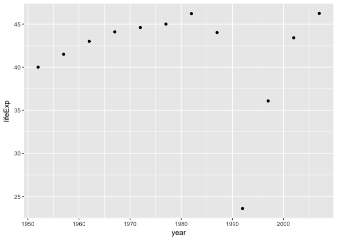

hw01
================

<a name=header> </a>

Table of Content
================

-   Work with the singer data [here](#header1)
-   Work with a nested data frame [here](#header2)

Loading packages
================

``` r
library(gapminder)
library(tidyverse)
library(robustbase)
```

    ## Warning: package 'robustbase' was built under R version 3.4.2

``` r
library(broom)
library(ggmap)
library(singer)
library(stringr)
```

<a name=header1> </a>

Work with the singer data
=========================

Question: The singer\_location dataframe in the singer package contains geographical information stored in two different formats: 1. as a (dirty!) variable named city; 2. as a latitude / longitude pair (stored in latitude, longitude respectively). The function revgeocode from the ggmap library allows you to retrieve some information for a pair (vector) of longitude, latitude.

**Creating a new variable known as pre\_loc based on locations predicted by revgeocode**

-   All the entries with NA in their location i.e. latitude or longitude was removed and only the top 200 entries were taken as it takes a lot of time for revgeocode to give result otherwise. There is also a restriction of 2500 entries which can be predicted by it.
-   Next mapply was used to apply revgeocode to these coordinates. I did not use mutate because I was not getting error each time.

``` r
new_data <-singer_locations
new_data<-new_data %>%
  filter(!is.na(latitude)) %>% 
  mutate(id=1:nrow(.)) %>% 
  filter(id<200)  
new_data$pre_loc <-mapply(FUN = function(lon, lat) revgeocode(c(lon, lat)), new_data$longitude, new_data$latitude)
```

**A glimpse of top twenty entries of pred\_loc and cities found in the singer\_location dataset**

-   revgencode was able to show result for all the 200 coordinates, so I don't have any case in which result is not shown thus unable to consider how to deal with them.

``` r
knitr::kable(head(new_data %>% 
  select(city,pre_loc),20))
```

| city                         | pre\_loc                                             |
|:-----------------------------|:-----------------------------------------------------|
| Chicago, IL                  | 123-135 North LaSalle Street, Chicago, IL 60602, USA |
| New York, NY                 | 80 Chambers St, New York, NY 10007, USA              |
| Detroit, MI                  | 2-44 Michigan Ave, Detroit, MI 48226, USA            |
| Pennsylvania                 | 997 Sand Ridge Rd, Howard, PA 16841, USA             |
| Oxnard, CA                   | 349 3rd Street, Oxnard, CA 93030, USA                |
| Bonn                         | An der Evangelischen Kirche 6, 53113 Bonn, Germany   |
| Hawaii                       | Unnamed Road, Hawaii, USA                            |
| Los Angeles, CA              | 262-298 W 1st St, Los Angeles, CA 90012, USA         |
| Staten Island, NY            | 215 Arthur Kill Rd, Staten Island, NY 10306, USA     |
| Portland, OR                 | Pacific Hwy W, Portland, OR 97201, USA               |
| UK - England - London        | 18-20 Whitehall, Westminster, London SW1A, UK        |
| Poggio Bustone, Rieti, Italy | Via Roma, 24, 02018 Poggio Bustone RI, Italy         |
| Pittsburgh, PA               | 408-414 Grant St, Pittsburgh, PA 15219, USA          |
| New York, NY                 | 80 Chambers St, New York, NY 10007, USA              |
| New York, NY                 | 320-398 Van Ness Ave, San Francisco, CA 94102, USA   |
| New York, NY                 | 80 Chambers St, New York, NY 10007, USA              |
| Los Angeles, CA              | 262-298 W 1st St, Los Angeles, CA 90012, USA         |
| California                   | Stump Springs Rd, Lakeshore, CA 93634, USA           |
| Panama                       | Calle Aviacion, Río Hato, Panama                     |
| KENT, WASHINGTON             | 220-298 4th Ave S, Kent, WA 98032, USA               |

**Next is comparing how many were correctly predicted by revgeocode**

-   The approach is I have dicided to divide the city variable into three variables as pre, post and last which each having string divided by space
-   Now if even one out of the three (pre,post or last) is sub-string of pre\_loc then I assume that they are predicting the same place (I ignore the case of the strings)

This is how I implement it

-   I have created two functions one known as comp which return if the sub-string is part of pred\_loc
-   Second is a function which returns result based on or operator (ex TRUE | FALSE = TRUE )

``` r
comp <- function(x,y){
    if(x!=""){
      z=mapply(grepl,x,y,ignore.case=TRUE)
    }
}
summ <- function(x,y,z){
  Reduce("|",c(x,y,z))
}
```

-   I have created new dataset city\_1 which only have city data and have the city divided into pre, post and last like i said before.
-   I have removed the NAs
-   I have also created another data set city\_2 which have predicted locations only
-   I have removed all the punctutations from both city\_1 and city\_2

``` r
city_1<-new_data %>% 
 select(city) %>% 
 separate(city,into=c("pre","post","last"),sep=" ") 
city_1[is.na(city_1)] <- ""
city_2<-new_data %>% 
  select(pre_loc)

city_2 <- mapply(str_replace_all,city_2,"[[:punct:]]","") 

city_1 <- mapply(str_replace_all,city_1,"[[:punct:]]","") 
```

-   A glimpse of how the two set look is:

``` r
knitr::kable(head(city_1,10))
```

| pre          | post    | last |
|:-------------|:--------|:-----|
| Chicago      | IL      |      |
| New          | York    | NY   |
| Detroit      | MI      |      |
| Pennsylvania |         |      |
| Oxnard       | CA      |      |
| Bonn         |         |      |
| Hawaii       |         |      |
| Los          | Angeles | CA   |
| Staten       | Island  | NY   |
| Portland     | OR      |      |

``` r
knitr::kable(head(city_2,10))
```

| pre\_loc                                         |
|:-------------------------------------------------|
| 123135 North LaSalle Street Chicago IL 60602 USA |
| 80 Chambers St New York NY 10007 USA             |
| 244 Michigan Ave Detroit MI 48226 USA            |
| 997 Sand Ridge Rd Howard PA 16841 USA            |
| 349 3rd Street Oxnard CA 93030 USA               |
| An der Evangelischen Kirche 6 53113 Bonn Germany |
| Unnamed Road Hawaii USA                          |
| 262298 W 1st St Los Angeles CA 90012 USA         |
| 215 Arthur Kill Rd Staten Island NY 10306 USA    |
| Pacific Hwy W Portland OR 97201 USA              |

-   Next step to see if either of pre,post or last is sub-string of predicted location
-   This is done by checking individual pre,post and last in predicted location using map function and comp function.
-   This will give me list for each pre,post and last wheather that sub-string is present or not (logical)
-   Next I have used mapply and summ to give result that even if any of pre,post or last is present in predicted location it will return TRUE for them.
-   I have used mapply because I have multiple arguments for each function and I want to specify them
-   I have displayed the result based on top 20 of the listings

``` r
present <- mapply(summ,map2(city_1[,'pre'],city_2,comp),map2(city_1[,'post'],city_2,comp),map2(city_1[,'last'],city_2,comp))
head(present,20)
```

    ##  [1]  TRUE  TRUE  TRUE FALSE  TRUE  TRUE  TRUE  TRUE  TRUE  TRUE  TRUE
    ## [12]  TRUE  TRUE  TRUE FALSE  TRUE  TRUE FALSE  TRUE  TRUE

-   For visualization purpose I have shown 2 of the false results

``` r
c(new_data$city[4],city_2[4])
```

    ## [1] "Pennsylvania"                         
    ## [2] "997 Sand Ridge Rd Howard PA 16841 USA"

``` r
c(new_data$city[15],city_2[15])
```

    ## [1] "New York, NY"                                  
    ## [2] "320398 Van Ness Ave San Francisco CA 94102 USA"

-   As it is clear from above two results the algorithm seems to be working fine

The cases which are True negatives (Correctly predicted but reported false)

-   If the city name in the predicted location is in shortform like TX and name in the city is Texas
-   If the matching string is beyond "last" i.e. the city name is very big and I am not able to capture all the strings

Total number of correctly predicted locations based on this algorithm is (out of 199):

``` r
sum(present)
```

    ## [1] 157

To go back to content table [here](#header)

<a name=header2> </a>

Work with a nested data frame
=============================

Question: Create a nested data frame and map a function over the list column holding the nested data. Use list extraction or other functions to pull interesting information out of these results and work your way back to a simple data frame you can visualize and explore

**Creating a nested data**

Nesting data by country and continent

``` r
nest_data <- gapminder %>% 
  group_by(country,continent) %>% 
  nest()
head(nest_data)
```

    ## # A tibble: 6 x 3
    ##       country continent              data
    ##        <fctr>    <fctr>            <list>
    ## 1 Afghanistan      Asia <tibble [12 x 4]>
    ## 2     Albania    Europe <tibble [12 x 4]>
    ## 3     Algeria    Africa <tibble [12 x 4]>
    ## 4      Angola    Africa <tibble [12 x 4]>
    ## 5   Argentina  Americas <tibble [12 x 4]>
    ## 6   Australia   Oceania <tibble [12 x 4]>

**Creating function for linear fit and quadratic fit and robust linear fit and also robust quadratic fit.**

-   Argument for the function are data, if robust method is used(1) or not(0) and model i.e if linear(0) or if Quadratic(1)
-   Default value if not specified is taken as robust and linear fit

``` r
mod_fit <- function(data,rob = 1,mod=0) {
  if(rob==1) lmrob(lifeExp ~ I(year-1950)+I(year^2*mod),data=data) else 
  lm(lifeExp ~ I(year-1950)+I(year^2*mod),data=data)
}
```

**Creating new variables for each fit type (lin, lin & rob, qad, qad & rob)**

-   Mutated vatiables fit\_ln\_nr, fit\_ln\_r, fit\_qd\_nr, fit\_qd\_n for linear fit, linear fit and robust, quadratic fit and quadratic fit and robust respictively.

``` r
nest_data <- nest_data %>% 
  mutate(fit_ln_nr= map(data,mod_fit,0,0) ,fit_ln_r= map(data,mod_fit,1,0),fit_qd_nr= map(data,mod_fit,0,1),fit_qd_r= map(data,mod_fit,1,1))
head(nest_data)
```

    ## # A tibble: 6 x 7
    ##       country continent              data fit_ln_nr    fit_ln_r fit_qd_nr
    ##        <fctr>    <fctr>            <list>    <list>      <list>    <list>
    ## 1 Afghanistan      Asia <tibble [12 x 4]>  <S3: lm> <S3: lmrob>  <S3: lm>
    ## 2     Albania    Europe <tibble [12 x 4]>  <S3: lm> <S3: lmrob>  <S3: lm>
    ## 3     Algeria    Africa <tibble [12 x 4]>  <S3: lm> <S3: lmrob>  <S3: lm>
    ## 4      Angola    Africa <tibble [12 x 4]>  <S3: lm> <S3: lmrob>  <S3: lm>
    ## 5   Argentina  Americas <tibble [12 x 4]>  <S3: lm> <S3: lmrob>  <S3: lm>
    ## 6   Australia   Oceania <tibble [12 x 4]>  <S3: lm> <S3: lmrob>  <S3: lm>
    ## # ... with 1 more variables: fit_qd_r <list>

Analysis 1 based on R-square and residues
-----------------------------------------

**Created a function which returns r-square summary**

``` r
r_square <- function(x){
  summary(x)$r.square
}
```

**Found all the countries which have a R square value of less than 0.8 (some other treshold can also be used here)**

``` r
outof_trend <-nest_data %>% 
  select(country,continent,fit_qd_r) %>% 
  filter(map(fit_qd_r,r_square)<0.8)
outof_trend
```

    ## # A tibble: 2 x 3
    ##    country continent    fit_qd_r
    ##     <fctr>    <fctr>      <list>
    ## 1 Bulgaria    Europe <S3: lmrob>
    ## 2   Rwanda    Africa <S3: lmrob>

**Checked each and every individual residue to see if any very large residue exist and to see iff there is strong pattern in the sign of residue.**

-   In Bulgaria there is 1 residue which is around -8 and rest all are distributed close to zero. There are equal number of positive and negative residue.
-   In Rwanda there is one huge negative residue less than -20 and moderately huge negative residue of value less than -5, number of positve and negative residues are equal but positive residues are much smaller than those of negative residues.

``` r
res_1 <-sort(resid(outof_trend$fit_qd_r[[1]]))
res_2 <-sort(resid(outof_trend$fit_qd_r[[2]]))
hist(res_1,xlab = "Residue",ylab="Frequency",main = "Freq vs Resid (Bulgaria)")
```


``` r
hist(res_2,xlab = "Residue",ylab="Frequency",main = "Freq vs Resid (Rwanda)")
```


**Visualization of data fpr these two countries**

-   Its clear from the plot that these data do not form any good trend due to few outlier data thus giving high residue value

``` r
gapminder %>% filter(country=="Bulgaria") %>% ggplot(aes(x=year,y=lifeExp)) + geom_point()
```


``` r
gapminder %>% filter(country=="Rwanda") %>% ggplot(aes(x=year,y=lifeExp)) + geom_point()
```



Analysis 2 based on coefficient difference between robust and ordinary just based on quadratic regression
---------------------------------------------------------------------------------------------------------

**Constructed a function which return True if the absolute difference in coefficients of x and x^2 between robust and normal are within the user given range**

-   Extrated the coefficients of x and x^2 (intercept was not taken as the value of intercept is huge on y axis)
-   If difference in coefficient of x is greater than 30 or x^2 greater than 1 then FALSE is returned (using "all" command)

``` r
coef <- function(x,y){
  all(abs(summary(x)$coefficient[2:3]-summary(y)$coefficient[2:3])<c(30,1))
}
```

**Selected just variable country, continent, quadratic fit for robust and normal and filtered the results where coef return FALSE**

``` r
nest_data %>% 
  select(country,continent,fit_qd_r,fit_qd_nr) %>%
  filter(map2(fit_qd_r,fit_qd_nr,coef)==FALSE)
```

    ## # A tibble: 9 x 4
    ##        country continent    fit_qd_r fit_qd_nr
    ##         <fctr>    <fctr>      <list>    <list>
    ## 1     Botswana    Africa <S3: lmrob>  <S3: lm>
    ## 2     Cambodia      Asia <S3: lmrob>  <S3: lm>
    ## 3     Cameroon    Africa <S3: lmrob>  <S3: lm>
    ## 4         Iraq      Asia <S3: lmrob>  <S3: lm>
    ## 5      Lesotho    Africa <S3: lmrob>  <S3: lm>
    ## 6      Namibia    Africa <S3: lmrob>  <S3: lm>
    ## 7 South Africa    Africa <S3: lmrob>  <S3: lm>
    ## 8    Swaziland    Africa <S3: lmrob>  <S3: lm>
    ## 9     Zimbabwe    Africa <S3: lmrob>  <S3: lm>

**Visualization of two these countries**

-   The difference in the coefficients between robust and normal regression is from the fact that robust regression is not affected by few outliers while normal regression gets affected by these outliers.
-   So if the difference is big it reflects that there are few or more outliers in the data which can be seen from the graph plotted

``` r
gapminder %>% filter(country=="Botswana") %>% ggplot(aes(x=year,y=lifeExp)) + geom_point()
```


``` r
gapminder %>% filter(country=="Cambodia") %>% ggplot(aes(x=year,y=lifeExp)) + geom_point()
```


To go back to content table [here](#header)
