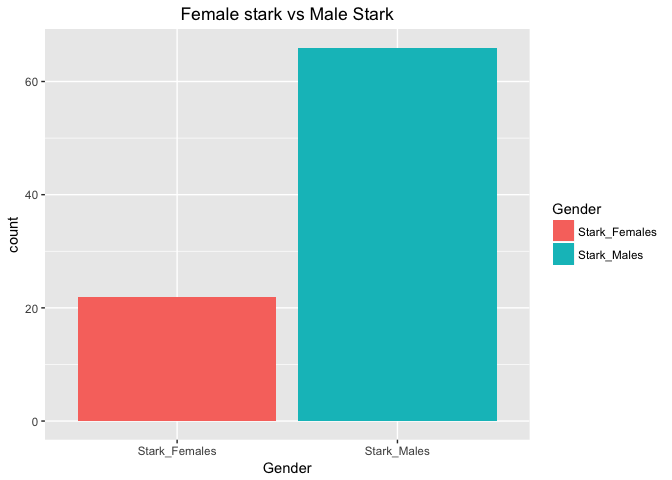
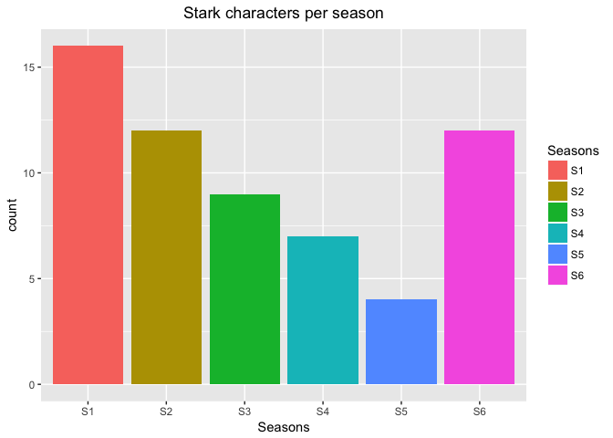
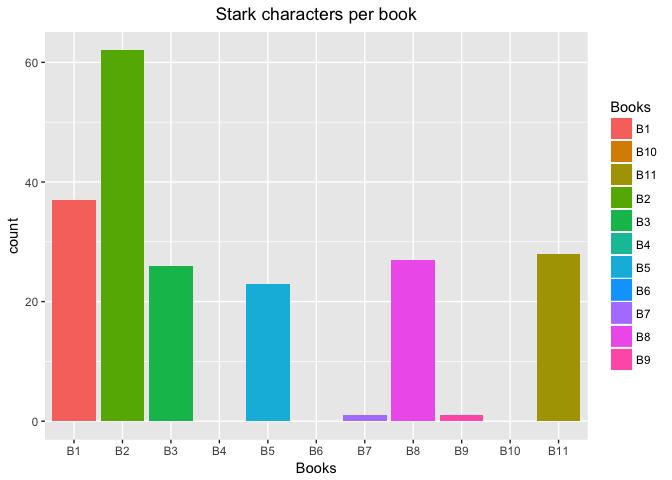
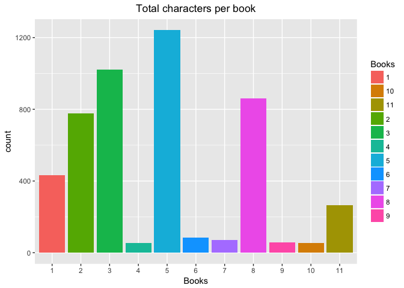

Hw05
================

Welcome to Hw05!!!

I am going to work on the task **Make API queries “by hand” using httr**
========================================================================

For this purpose I am going to work with the Game of Thrones API called *Ice And Fire* which you can find [here](https://anapioficeandfire.com/). The overall limit is 20k per Ip Adress. Data format is JSON

Loading libraries
=================

``` r
library(tidyverse)
library(jsonlite)
library(purrr)
library(tibble)
library(ggplot2)
library(forcats)
library(glue)
```

The overall process
-------------------

-   I first extracted the data for "Stark of Winterfell" family.
    -   Here I am using **"FromJSON"** as the data is in JSON format (API - <https://anapioficeandfire.com/api/houses/362>)

``` r
Stark <- fromJSON("https://anapioficeandfire.com/api/houses/362")
```

List of Members URL

``` r
head(Stark$swornMembers,10)
```

    ##  [1] "https://www.anapioficeandfire.com/api/characters/2"  
    ##  [2] "https://www.anapioficeandfire.com/api/characters/20" 
    ##  [3] "https://www.anapioficeandfire.com/api/characters/97" 
    ##  [4] "https://www.anapioficeandfire.com/api/characters/98" 
    ##  [5] "https://www.anapioficeandfire.com/api/characters/136"
    ##  [6] "https://www.anapioficeandfire.com/api/characters/143"
    ##  [7] "https://www.anapioficeandfire.com/api/characters/148"
    ##  [8] "https://www.anapioficeandfire.com/api/characters/170"
    ##  [9] "https://www.anapioficeandfire.com/api/characters/181"
    ## [10] "https://www.anapioficeandfire.com/api/characters/192"

-   Then I created a tibble with First variable House name, next House Members name, next his Gender, next Tv series he is in, next Books he is in.
    -   For this the family have sub list named members where the API's for all other members are listed
    -   I then directly used these API's without making changes as they were exact, and created a tibble with first column House name and information about each member by again using **"FromJASON"** and map (Purrr) and named Mem\_info.
    -   Then I created another columns named Name (chr), Gender(chr), Books(list),TvSeries (list) from the data of Mem\_info.

A Function which return list with name y from the list x

``` r
Infor <- function(x,y="name"){
    if (y=="name"){
        unlist(x$name)
    } else if(y=="gender"){
        unlist(x$gender)
    } else if(y=="tvSeries"){
        sub(".*Season ","",unlist(x$tvSeries))
    } else if(y=="books"){
        sub(".*books/","",unlist(x$books))
    }
}
```

Creating the tibble

``` r
Stark_info <- tibble(House=Stark$name,Mem_info=map(Stark$swornMembers,fromJSON),Name=map2(Mem_info,"name",Infor),Gender=map2(Mem_info,"gender",Infor),Books=map2(Mem_info,"books",Infor),TvSeries_Seas=map2(Mem_info,"tvSeries",Infor)) %>% select(House,Name,Gender,TvSeries_Seas,Books) 
```

A glimpse of tibble

``` r
knitr::kable(head(Stark_info,10))
```

| House                     | Name            | Gender | TvSeries\_Seas   | Books         |
|:--------------------------|:----------------|:-------|:-----------------|:--------------|
| House Stark of Winterfell | Walder          | Male   | 1, 2, 3, 4, 6    | 1, 2, 3, 5, 8 |
| House Stark of Winterfell | Mordane         | Female | 1                | 1, 2, 3       |
| House Stark of Winterfell | Alys Karstark   | Female |                  | 11            |
| House Stark of Winterfell | Alys Karstark   | Female |                  | 11            |
| House Stark of Winterfell | Arra Norrey     | Female |                  | 11            |
| House Stark of Winterfell | Artos Stark     | Male   |                  | 2, 8, 11      |
| House Stark of Winterfell | Arya Stark      | Female | 1, 2, 3, 4, 5, 6 |               |
| House Stark of Winterfell | Barthogan Stark | Male   |                  | 2, 11         |
| House Stark of Winterfell | Benjen Stark    | Male   | 1, 6             | 1, 2, 3, 5, 8 |
| House Stark of Winterfell | Beron Stark     | Male   |                  | 2, 7, 11      |

-   Now I plotted how many males and females are there in each house (bar graph)

``` r
Total_females <- nrow(Stark_info %>% filter(Gender=="Female"))
Total_Males <- nrow(Stark_info %>% filter(Gender=="Male"))
Pop <- data_frame(Gender=c("Stark_Males","Stark_Females"),Pop=c(Total_Males,Total_females))
ggplot(Pop,aes(x=Gender,weight=Pop)) + geom_bar(aes(fill=Gender))+labs(title="Female stark vs Male Stark") + theme(plot.title = element_text(hjust=0.5))
```



-   I also plotted how many characters from this house were there in each season and each book (Bar Graph)

**EACH SEASON**

Function returns a list of true and false for each "1" to "y" in the character array x

``` r
ret <- function(x,y){
    a=c()
    for (i in 1:y){
        a=cbind(a,as.character(i) %in% unlist(x))
    }
    return(a)
}
```

**First unlisted the list got from map and then created a matrix with 6 rows with each column representing a charatcter and each row a season and took transpose.** **Then created a tibble and plotted them**

``` r
All_char_all_seas <- t(matrix(unlist(unlist(map2(Stark_info$TvSeries_Seas,6,ret))),nrow = 6))
```

Glimpse of matrix

``` r
head(All_char_all_seas,10)
```

    ##        [,1]  [,2]  [,3]  [,4]  [,5]  [,6]
    ##  [1,]  TRUE  TRUE  TRUE  TRUE FALSE  TRUE
    ##  [2,]  TRUE FALSE FALSE FALSE FALSE FALSE
    ##  [3,] FALSE FALSE FALSE FALSE FALSE FALSE
    ##  [4,] FALSE FALSE FALSE FALSE FALSE FALSE
    ##  [5,] FALSE FALSE FALSE FALSE FALSE FALSE
    ##  [6,] FALSE FALSE FALSE FALSE FALSE FALSE
    ##  [7,]  TRUE  TRUE  TRUE  TRUE  TRUE  TRUE
    ##  [8,] FALSE FALSE FALSE FALSE FALSE FALSE
    ##  [9,]  TRUE FALSE FALSE FALSE FALSE  TRUE
    ## [10,] FALSE FALSE FALSE FALSE FALSE FALSE

Plot here on

``` r
Char_seas <- tibble(Seasons = c("S1","S2","S3","S4","S5","S6"),Char_count=colSums(All_char_all_seas))

ggplot(Char_seas,aes(x=Seasons,weight=Char_count)) + geom_bar(aes(fill=Seasons))+labs(title="Stark characters per season") + theme(plot.title = element_text(hjust=0.5))
```



**EACH BOOK**

**First unlisted the list got from map and then created a matrix with 11 (as 11 books) rows with each column representing a charatcter and each row a book and then took transpose.** **Then created a tibble and plotted them**

``` r
All_char_all_books <- t(matrix(unlist(unlist(map2(Stark_info$Books,11,ret))),nrow = 11))
```

Glimpse of matrix

``` r
head(All_char_all_books,10)
```

    ##        [,1]  [,2]  [,3]  [,4]  [,5]  [,6]  [,7]  [,8]  [,9] [,10] [,11]
    ##  [1,]  TRUE  TRUE  TRUE FALSE  TRUE FALSE FALSE  TRUE FALSE FALSE FALSE
    ##  [2,]  TRUE  TRUE  TRUE FALSE FALSE FALSE FALSE FALSE FALSE FALSE FALSE
    ##  [3,] FALSE FALSE FALSE FALSE FALSE FALSE FALSE FALSE FALSE FALSE  TRUE
    ##  [4,] FALSE FALSE FALSE FALSE FALSE FALSE FALSE FALSE FALSE FALSE  TRUE
    ##  [5,] FALSE FALSE FALSE FALSE FALSE FALSE FALSE FALSE FALSE FALSE  TRUE
    ##  [6,] FALSE  TRUE FALSE FALSE FALSE FALSE FALSE  TRUE FALSE FALSE  TRUE
    ##  [7,] FALSE FALSE FALSE FALSE FALSE FALSE FALSE FALSE FALSE FALSE FALSE
    ##  [8,] FALSE  TRUE FALSE FALSE FALSE FALSE FALSE FALSE FALSE FALSE  TRUE
    ##  [9,]  TRUE  TRUE  TRUE FALSE  TRUE FALSE FALSE  TRUE FALSE FALSE FALSE
    ## [10,] FALSE  TRUE FALSE FALSE FALSE FALSE  TRUE FALSE FALSE FALSE  TRUE

Plot here on

``` r
Ordering <- c("B1","B2","B3","B4","B5","B6","B7","B8","B9","B10","B11")
Char_seas <- tibble(Books=Ordering,Char_count=colSums(All_char_all_books))

ggplot(Char_seas,aes(x=fct_reorder(Books,c(1:11)),weight=Char_count)) + geom_bar(aes(fill=Books))+labs(title="Stark characters per book") + theme(plot.title = element_text(hjust=0.5)) + scale_x_discrete("Books")
```



-   Next I took each book and plotted number of characters in each book (bar graph)
    -   I got the data usinf **fromJSON** on the following [APIs](https://anapioficeandfire.com/api/books/10)
    -   The format is again JSON
-   First I made a tibble with column Books having books from 1 to 11
-   Next I mutated Information about each book using glue, map and fromJSON

``` r
Ordering <- c("1","2","3","4","5","6","7","8","9","10","11")
book_data <- tibble(Books = Ordering)
book_data <- book_data %>% mutate(data=map(glue("https://anapioficeandfire.com/api/books/{Books}"),fromJSON))
```

-   Next I mutated another column named Tcharacters which is total sum of characters in each book
-   Removed the data column

``` r
book_data_comp <- book_data %>% mutate(Tcharacters = unlist(map(data,function(x){length(x$characters)}))) %>% select(-data)
```

Glimpse of tibble

``` r
knitr::kable(book_data_comp)
```

| Books |  Tcharacters|
|:------|------------:|
| 1     |          434|
| 2     |          778|
| 3     |         1021|
| 4     |           54|
| 5     |         1241|
| 6     |           84|
| 7     |           71|
| 8     |          861|
| 9     |           57|
| 10    |           55|
| 11    |          265|

Plotting the number of characters in each book

``` r
ggplot(book_data_comp,aes(x=fct_reorder(Books,c(1:11)),weight=Tcharacters)) + geom_bar(aes(fill=Books))+labs(title="Total characters per book") + theme(plot.title = element_text(hjust=0.5)) + scale_x_discrete("Books")
```



Saving data for future use
--------------------------

``` r
saveRDS(Stark_info,"Stark_family.rds")
saveRDS(book_data_comp,"Book_char_details.rds")
```
